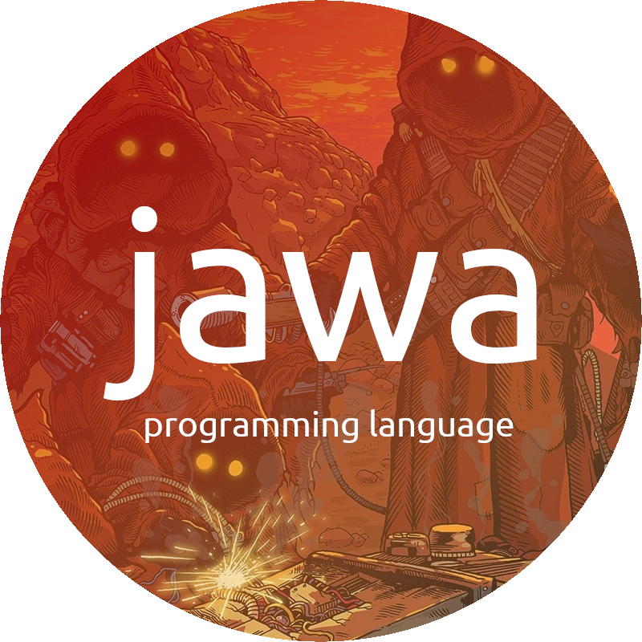

# jawa
 

 
Jawa is a minimalistic toy programming language made to make you feel like a little alien
on a deserted planet chaotically hacking away at a droid's internals. It features only 8 operations and the program 
memory lives along side data memory. Each line of jawa code is placed in memory and is 
accessable through it's line number. You can use this to alter data by line number or 
even the code itself during runtime. Jawa is currently an interpreted language. I hold future plans to write
a compiler and to add parallel simultaneous subroutines called "droids".

### Operations
| Name   | bits | Description                                           |
|--------|------|-------------------------------------------------------|
| end    | 0    | Program's end. Empty lines will also end the program. |
| start  | 1    | Program's starting point.                             |
| add X  | 2    | Add the value in box to X. (X += box)                 |
| sub X  | 3    | Subtract the value in box from X. (X -= box)          |
| box X  | 4    | Put the value of X into box (box = X)                 |
| go X   | 5    | Move program pointer to X line.                       |
| if X   | 6    | If box == 0 move program to X line.                   |
| draw X | 7    | Prints character encoded by value at X.               |

### How it works
A jawa program lives on a integer array 1024 numbers long, so jawa code is 
limited to 1024 lines. Each integer represents a line of code where the first
3 bits of the 32 bits represent the operation, the remaining 29 bits represent
the argument X value. Also there is the 'box', a buffer where you can hold one value to do operations
with. The program executes the instructions on the current line then moves on to the
next line, flow control of the program pointer is achieved with 'go' and 'if'.

### Code example

